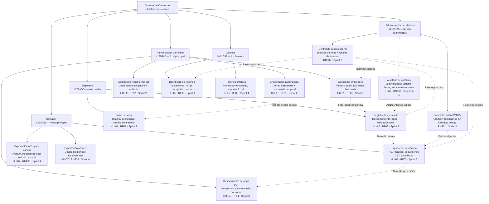

# Diagrama de roles y módulos — Sistema de Control de Asistencia y Nómina
**Proyecto:** Propuesta 07 – ADSO 220501094  
**Metodología:** Scrum + Kanban  
**Sector:** Recursos Humanos – PyMES, Neiva, Colombia

---

## 1. Sistema de diseño visual — Paleta de colores

> Requisito no funcional de UI: el sistema debe usar colores alineados a un entorno empresarial formal, transmitiendo confianza, autoridad y claridad financiera.

### 1.1 Color primario — Azul (confianza y autoridad)

| Token | Hex | Uso principal |
|-------|-----|---------------|
| `color-primary-900` | `#042C53` | Textos sobre fondo azul, encabezados de alto contraste |
| `color-primary-700` | `#185FA5` | Color de marca principal, botones primarios, links activos |
| `color-primary-500` | `#378ADD` | Iconos, bordes activos, indicadores de progreso |
| `color-primary-200` | `#B5D4F4` | Fondos de chips, badges informativos |
| `color-primary-50`  | `#E6F1FB` | Fondos de secciones info, hover suave en filas |

### 1.2 Color secundario — Verde (finanzas y acciones positivas)

| Token | Hex | Uso principal |
|-------|-----|---------------|
| `color-secondary-900` | `#173404` | Textos sobre fondo verde, etiquetas de éxito oscuras |
| `color-secondary-700` | `#3B6D11` | Botones de confirmación, estados aprobados, montos positivos |
| `color-secondary-500` | `#639922` | Iconos de éxito, barras de progreso completadas |
| `color-secondary-200` | `#C0DD97` | Fondos de badges de aprobación |
| `color-secondary-50`  | `#EAF3DE` | Fondos de paneles de éxito, filas aprobadas |

### 1.3 Neutros — Estructura y jerarquía

| Token | Hex | Uso principal |
|-------|-----|---------------|
| `color-neutral-text-primary`   | `#2C2C2A` | Texto principal en toda la interfaz |
| `color-neutral-text-secondary` | `#5F5E5A` | Texto secundario, descripciones, etiquetas |
| `color-neutral-border`         | `#B4B2A9` | Bordes de inputs, tablas, tarjetas |
| `color-neutral-divider`        | `#D3D1C7` | Líneas divisoras entre secciones |
| `color-neutral-bg-page`        | `#F1EFE8` | Fondo general de la aplicación |

### 1.4 Colores semánticos — Estados del sistema

| Estado | Fondo | Acento | Token fondo | Token acento | Uso |
|--------|-------|--------|-------------|--------------|-----|
| Éxito / Aprobado | `#EAF3DE` | `#3B6D11` | `color-semantic-success-bg` | `color-semantic-success-accent` | Asistencia registrada OK, nómina liquidada, pago aprobado |
| Alerta / Pendiente | `#FAEEDA` | `#854F0B` | `color-semantic-warning-bg` | `color-semantic-warning-accent` | Registro pendiente de aprobación, desprendible no enviado |
| Error / Rechazado | `#FCEBEB` | `#A32D2D` | `color-semantic-error-bg` | `color-semantic-error-accent` | Reconocimiento facial fallido, GPS fuera de rango, error SMTP |
| Info / En proceso | `#E6F1FB` | `#185FA5` | `color-semantic-info-bg` | `color-semantic-info-accent` | Registro en curso, nómina en cálculo, exportación procesando |

### 1.5 Aplicación de colores por módulo y rol

| Rol | Color de rol | Hex principal | Uso en UI |
|-----|-------------|---------------|-----------|
| Administrador de RRHH | Azul principal | `#185FA5` | Header de panel RRHH, botones de acción primaria |
| Empleado | Azul medio | `#378ADD` | Panel personal, botón de registro de entrada/salida |
| Contador | Verde principal | `#3B6D11` | Módulos de nómina y exportación financiera |
| Gerente | Azul oscuro | `#042C53` | Dashboard ejecutivo, gráficas de reportes |
| Administrador del sistema | Neutro texto primario | `#2C2C2A` | Paneles de auditoría, configuración del sistema |

---

## 2. Diagrama estructural (Mermaid)



---

## 3. Tabla estructurada de roles y módulos

| Rol | Color UI | Módulo | Historia de usuario | Requisito | Sprint | Descripción |
|-----|----------|--------|-------------------|-----------|--------|-------------|
| Administrador de RRHH | `#185FA5` | Gestión de empleados | HU-01 | RF01 | Sprint 1 | Registro completo: nombre, cédula, cargo, salario, tipo contrato, EPS, AFP, ARL. Captura de foto facial para biometría. Validación de duplicados. |
| Administrador de RRHH | `#185FA5` | Desprendibles de pago PDF | HU-04 | RF04 | Sprint 3 | Generación de PDF por empleado con devengados, deducciones y neto. Envío masivo por correo electrónico. |
| Administrador de RRHH | `#185FA5` | Credenciales automáticas | HU-08 | RF01 | Sprint 2 | Envío automático de correo con contraseña temporal al registrar empleado. Opción de reenvío manual. |
| Administrador de RRHH | `#185FA5` | Aprobación registro manual | HU-02 | RF02 | Sprint 2 | Cuando falla biométrica/GPS, el admin registra asistencia con justificación obligatoria. Queda en auditoría. |
| Empleado | `#378ADD` | Registro de asistencia | HU-02 | RF02 | Sprint 2 | Reconocimiento facial (face-api.js, similitud ≥ 80%) + validación GPS (radio 100 m). Calcula horas trabajadas del turno. |
| Empleado | `#378ADD` | Portal personal | HU-09 | RF01 | Sprint 2 | Panel restringido: entrada/salida, historial de asistencias (solo lectura), cambio de contraseña. Sin acceso a módulos de otros roles. |
| Contador | `#3B6D11` | Liquidación de nómina | HU-03 | RF03 | Sprint 3 | Motor de cálculo: salario base, HE diurnas (25%), HE nocturnas (75%), dominicales, festivos, salud (4%), pensión (4%). Conforme al CST colombiano. |
| Contador | `#3B6D11` | Exportación ACH para bancos | HU-07 | RNF03 | Sprint 4 | Archivo .txt delimitado con cuenta, valor y nombre. Formato configurable por entidad bancaria para dispersión masiva. |
| Contador | `#3B6D11` | Exportación a Excel | HU-07 | RNF03 | Sprint 4 | Archivo .xlsx con detalle completo del período liquidado. |
| Gerente | `#042C53` | Dashboard de reportes | HU-05 | RF05 | Sprint 4 | Gráficas de barras comparativas por mes: días trabajados, ausencias, horas extras y costo total por empleado. |
| Gerente | `#042C53` | Reportes filtrables | HU-05 | RF05 | Sprint 4 | Filtro por rango de fechas y empleado. Exportación a Excel (.xlsx). |
| Administrador del sistema | `#2C2C2A` | Auditoría de cambios | HU-06 | RNF02 | Sprints 2–4 | Historial inmutable de modificaciones en asistencia: usuario, fecha/hora, valor anterior y nuevo. Registros de solo lectura. |
| Administrador del sistema | `#2C2C2A` | Parametrización SMMLV | — | RNF01 | Sprint 3 | Panel para actualizar SMMLV, porcentajes de aportes y retenciones sin modificar código fuente. Historial con fecha de vigencia. |
| Administrador del sistema | `#2C2C2A` | Control de acceso por rol | HU-09 | RNF02 | Sprint 2 | Bloqueo automático de rutas según rol. Intentos no autorizados se registran en auditoría. |

---

## 4. Estados del sistema con colores semánticos por módulo

| Módulo | Estado posible | Fondo | Acento | Descripción del estado |
|--------|---------------|-------|--------|------------------------|
| Registro de asistencia | Éxito / Registrado | `#EAF3DE` | `#3B6D11` | Facial + GPS validados, timestamp guardado |
| Registro de asistencia | Error / Rechazado | `#FCEBEB` | `#A32D2D` | Facial no coincide o GPS fuera de rango (< 80% similitud o > 100 m) |
| Registro de asistencia | Info / En proceso | `#E6F1FB` | `#185FA5` | Cámara activa, verificando reconocimiento |
| Aprobación registro manual | Alerta / Pendiente | `#FAEEDA` | `#854F0B` | Registro manual esperando aprobación del admin |
| Aprobación registro manual | Éxito / Aprobado | `#EAF3DE` | `#3B6D11` | Admin aprobó el registro con justificación |
| Aprobación registro manual | Error / Rechazado | `#FCEBEB` | `#A32D2D` | Admin rechazó el registro manual |
| Liquidación de nómina | Info / En proceso | `#E6F1FB` | `#185FA5` | Motor calculando nómina del período |
| Liquidación de nómina | Éxito / Liquidada | `#EAF3DE` | `#3B6D11` | Nómina calculada y lista para desprendibles |
| Desprendibles PDF | Alerta / Pendiente | `#FAEEDA` | `#854F0B` | PDF generado pero correo no enviado aún |
| Desprendibles PDF | Éxito / Enviado | `#EAF3DE` | `#3B6D11` | Correo entregado exitosamente al empleado |
| Desprendibles PDF | Error / Fallido | `#FCEBEB` | `#A32D2D` | Error SMTP — correo no pudo enviarse |
| Credenciales automáticas | Éxito / Enviado | `#EAF3DE` | `#3B6D11` | Correo con credenciales entregado |
| Credenciales automáticas | Error / Fallido | `#FCEBEB` | `#A32D2D` | Correo inválido o error de servidor SMTP |
| Exportación ACH / Excel | Info / En proceso | `#E6F1FB` | `#185FA5` | Archivo generándose |
| Exportación ACH / Excel | Éxito / Listo | `#EAF3DE` | `#3B6D11` | Archivo descargable disponible |

---

## 5. Relaciones cruzadas entre módulos

| Módulo origen | Módulo destino | Tipo de relación |
|---------------|---------------|-----------------|
| Gestión de empleados (RRHH) | Registro de asistencia (Empleado) | Comparte foto facial del enrollment biométrico |
| Auditoría de cambios (Admin sistema) | Registro de asistencia (Empleado) | Registra intentos fallidos de reconocimiento facial/GPS |
| Credenciales automáticas (RRHH) | Portal personal (Empleado) | Las credenciales generadas habilitan el primer acceso |
| Liquidación de nómina (Contador) | Desprendibles PDF (RRHH) | La nómina calculada alimenta la generación del desprendible |
| Liquidación de nómina (Contador) | Exportación ACH/Excel (Contador) | Los datos liquidados se exportan para banco y reporte |
| Registro de asistencia (Empleado) | Liquidación de nómina (Contador) | Las horas registradas son la base del cálculo de nómina |
| Parametrización SMMLV (Admin sistema) | Liquidación de nómina (Contador) | Los valores configurados se aplican en el siguiente período |
| Control de acceso por rol (Admin sistema) | Todos los módulos | Restringe qué rutas y funciones puede ver cada rol |

---

## 6. Resumen por sprint

| Sprint | Objetivo | Roles involucrados | Módulos | Color dominante |
|--------|----------|--------------------|---------|----------------|
| Sprint 1 | Registro de empleados | Administrador de RRHH | Gestión de empleados | `#185FA5` Azul principal |
| Sprint 2 | Control de asistencia y acceso | Empleado, Administrador de RRHH, Administrador del sistema | Registro de asistencia, Portal personal, Credenciales automáticas, Aprobación manual, Control de acceso, Auditoría (base) | `#378ADD` Azul medio |
| Sprint 3 | Liquidación de nómina | Contador, Administrador de RRHH, Administrador del sistema | Liquidación de nómina, Desprendibles PDF, Parametrización SMMLV | `#3B6D11` Verde principal |
| Sprint 4 | Reportes y exportación | Gerente, Contador, Administrador del sistema | Dashboard, Reportes filtrables, Exportación ACH, Exportación Excel, Auditoría (consulta) | `#042C53` Azul oscuro |

---

## 7. Tokens de diseño (variables CSS / design tokens)

> Bloque listo para importar en cualquier sistema de diseño (Figma tokens, CSS custom properties, Tailwind config, etc.)

```json
{
  "color": {
    "primary": {
      "900": "#042C53",
      "700": "#185FA5",
      "500": "#378ADD",
      "200": "#B5D4F4",
      "50":  "#E6F1FB"
    },
    "secondary": {
      "900": "#173404",
      "700": "#3B6D11",
      "500": "#639922",
      "200": "#C0DD97",
      "50":  "#EAF3DE"
    },
    "neutral": {
      "text-primary":   "#2C2C2A",
      "text-secondary": "#5F5E5A",
      "border":         "#B4B2A9",
      "divider":        "#D3D1C7",
      "bg-page":        "#F1EFE8"
    },
    "semantic": {
      "success": { "bg": "#EAF3DE", "accent": "#3B6D11" },
      "warning": { "bg": "#FAEEDA", "accent": "#854F0B" },
      "error":   { "bg": "#FCEBEB", "accent": "#A32D2D" },
      "info":    { "bg": "#E6F1FB", "accent": "#185FA5" }
    },
    "roles": {
      "admin-rrhh":    "#185FA5",
      "empleado":      "#378ADD",
      "contador":      "#3B6D11",
      "gerente":       "#042C53",
      "admin-sistema": "#2C2C2A"
    }
  }
}
```

```css
/* CSS custom properties */
:root {
  /* Primario - Azul */
  --color-primary-900: #042C53;
  --color-primary-700: #185FA5;
  --color-primary-500: #378ADD;
  --color-primary-200: #B5D4F4;
  --color-primary-50:  #E6F1FB;

  /* Secundario - Verde */
  --color-secondary-900: #173404;
  --color-secondary-700: #3B6D11;
  --color-secondary-500: #639922;
  --color-secondary-200: #C0DD97;
  --color-secondary-50:  #EAF3DE;

  /* Neutros */
  --color-text-primary:   #2C2C2A;
  --color-text-secondary: #5F5E5A;
  --color-border:         #B4B2A9;
  --color-divider:        #D3D1C7;
  --color-bg-page:        #F1EFE8;

  /* Semánticos */
  --color-success-bg:     #EAF3DE;
  --color-success-accent: #3B6D11;
  --color-warning-bg:     #FAEEDA;
  --color-warning-accent: #854F0B;
  --color-error-bg:       #FCEBEB;
  --color-error-accent:   #A32D2D;
  --color-info-bg:        #E6F1FB;
  --color-info-accent:    #185FA5;
}
```