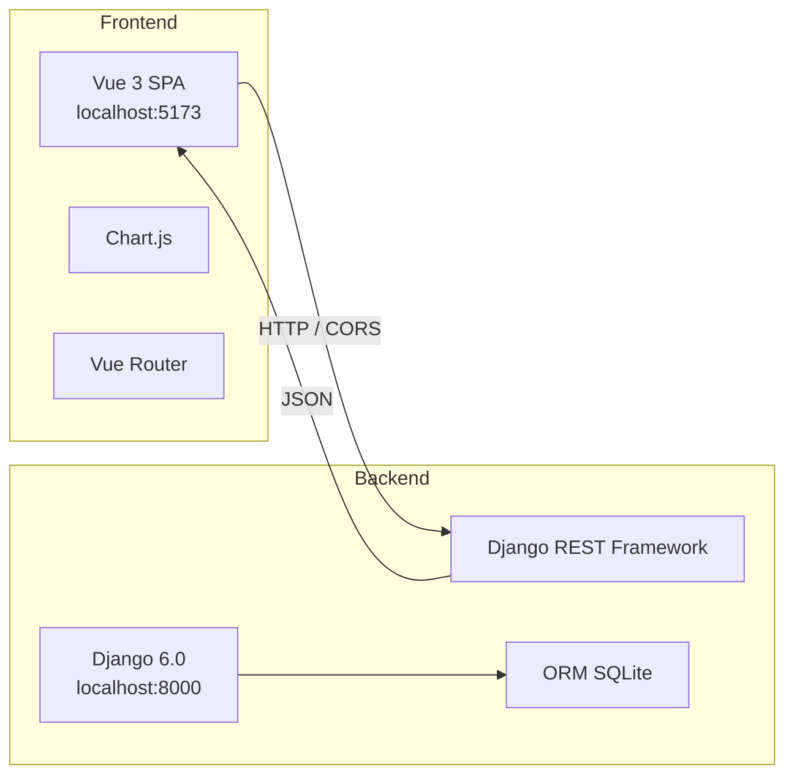
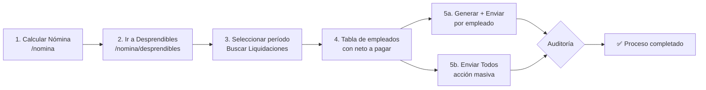

# SoftVar — Sistema de Control de Asistencia y Nómina

> **Versión:** `1.4.0`  
> **Proyecto:** Propuesta 07 – ADSO 220501094  
> **Sector:** Recursos Humanos – PyMES, Neiva, Colombia  
> **Metodología:** Scrum + Kanban

---

## 📋 Tabla de Contenido

- [Descripción](#-descripción)
- [Stack Tecnológico](#-stack-tecnológico)
- [Arquitectura](#-arquitectura)
- [Estructura del Proyecto](#-estructura-del-proyecto)
- [Modelo de Datos](#-modelo-de-datos)
- [API REST](#-api-rest)
- [Frontend — Sistema de Diseño](#-frontend--sistema-de-diseño)
- [Instalación y Configuración](#-instalación-y-configuración)
- [Uso y Desarrollo](#-uso-y-desarrollo)
- [Módulos y Roles](#-módulos-y-roles)
- [Sprint Plan](#-sprint-plan)
- [Versionado](#-versionado)
- [Licencia](#-licencia)

---

## 📖 Descripción

Sistema web integral para la gestión de **control de asistencia** y **liquidación de nómina** diseñado para PyMES colombianas. Integra reconocimiento facial biométrico, validación geográfica por GPS, cálculo de nómina conforme al CST colombiano, generación de desprendibles PDF y exportación bancaria ACH.

### Funcionalidades principales

| Módulo | Descripción |
|--------|-------------|
| **Gestión de empleados** | CRUD completo con captura biométrica facial, validación de duplicados, búsqueda |
| **Registro de asistencia** | Reconocimiento facial (face-api.js, similitud ≥ 80%) + GPS (radio 100 m) |
| **Portal personal** | Historial de asistencias, marcación entrada/salida, cambio de contraseña |
| **Liquidación de nómina** | Motor de cálculo: HE diurnas (25%), nocturnas (75%), salud (4%), pensión (4%) |
| **Desprendibles PDF** | Generación de PDF con diseño profesional (logo, devengados, deducciones, neto), envío individual y masivo por correo electrónico |
| **Dashboard de reportes** | Gráficas interactivas con Chart.js conectado a datos reales de la BD |
| **Reenvío de credenciales** | Botón en tarjeta/tabla de empleados para reenviar credenciales por correo |
| **Exportación ACH** | Archivo .txt delimitado por entidad bancaria |
| **Auditoría** | Registro inmutable de cambios en el sistema |

---

## 🛠 Stack Tecnológico

### Backend

| Tecnología | Versión | Uso |
|------------|---------|-----|
| Python | 3.12+ | Lenguaje de programación |
| Django | 6.0.5 | Framework web principal |
| Django REST Framework | — | API RESTful |
| django-cors-headers | — | CORS para frontend |
| django-filter | — | Filtros avanzados para API |
| SQLite | — | Base de datos (desarrollo) |
| ReportLab | 4.x | Generación de PDF de desprendibles de nómina |

### Frontend

| Tecnología | Versión | Uso |
|------------|---------|-----|
| Vue.js | 3.5.13 | Framework frontend |
| Vue Router | 5.0.7 | Enrutamiento SPA |
| Vite | 8.0.8 | Bundler y dev server |
| Chart.js | 4.5.1 | Gráficas interactivas |
| Axios | 1.16.1 | Cliente HTTP |
| jsPDF | 4.2.1 | Generación de PDF |
| face-api.js | — | Reconocimiento facial biométrico |
| Work Sans | — | Tipografía principal UI |
| Young Serif | — | Tipografía para títulos |

---

## 🏗 Arquitectura



### Patrón: SPA + API REST

El frontend (Vue 3 SPA) se comunica con el backend (Django REST Framework) a través de una API RESTful con autenticación por sesiones. El backend utiliza SQLite como motor de base de datos en desarrollo, con migraciones gestionadas por Django ORM.

---

## 📁 Estructura del Proyecto

```
📦 SOFTVAR/
├── 📂 backend/                        # Backend Django
│   ├── 📂 empleados/                  # App de empleados
│   │   ├── 📂 management/             # Comandos personalizados
│   │   ├── 📂 migrations/             # Migraciones BD
│   │   │   ├── 0001_initial.py
│   │   │   ├── ...
│   │   │   ├── 0008_liquidacionnomina_desprendible.py
│   │   │   ├── 0009_liquidacionnomina_salario_base_original_and_more.py
│   │   │   └── 0010_alter_asistencia_fecha_hora.py
│   │   ├── 📂 management/commands/
│   │   │   ├── seed_asistencias.py     # Seed de datos de asistencia
│   │   │   └── seed_usuarios.py        # Seed de usuarios
│   │   ├── 📂 tests/                  # Tests unitarios
│   │   │   └── test_api.py
│   │   ├── admin.py                   # Panel admin Django
│   │   ├── apps.py                    # Configuración app
│   │   ├── models.py                  # Modelos: Empleado, Asistencia, LiquidacionNomina, Desprendible, Auditoria, ParametroSistema
│   │   ├── nomina_engine.py           # Motor de cálculo de nómina (CST colombiano)
│   │   ├── serializers.py             # Serializador REST + envío credenciales por correo
│   │   ├── urls.py                    # Rutas API
│   │   ├── utils.py                   # Utilidades: auditoría, parámetros del sistema
│   │   └── views.py                   # Vistas: API endpoints (asistencia, nómina, desprendibles PDF, reportes)
│   ├── asgi.py                        # Configuración ASGI
│   ├── settings.py                    # Configuración Django
│   ├── urls.py                        # Rutas raíz
│   └── wsgi.py                        # Configuración WSGI
│
├── 📂 frontend/                       # Frontend Vue 3
│   ├── 📂 src/
│   │   ├── 📂 assets/styles/
│   │   │   └── main.css              # Sistema de diseño (variables CSS)
│   │   ├── 📂 components/
│   │   │   └── 📂 empleados/
│   │   │       ├── EmpleadoCard.vue   # Tarjeta de empleado
│   │   │       └── FotoFacialUpload.vue # Captura biométrica
│   │   ├── 📂 views/
│   │   │   ├── 📂 asistencia/
│   │   │   │   └── RegistroAsistencia.vue
│   │   │   ├── 📂 auth/
│   │   │   │   ├── Login.vue
│   │   │   │   └── ResetPassword.vue
│   │   │   ├── 📂 configuracion/
│   │   │   │   └── Index.vue
│   │   │   ├── 📂 empleados/
│   │   │   │   ├── EmpleadoForm.vue
│   │   │   │   ├── ListEmpleados.vue
│   │   │   │   └── PortalPersonal.vue
│   │   │   ├── 📂 nomina/
│   │   │   │   ├── DesprendiblesPdf.vue    # Desprendibles PDF con envío masivo
│   │   │   │   └── LiquidacionNomina.vue   # Liquidación con ajuste SMMLV
│   │   │   └── 📂 reportes/
│   │   │       ├── DashboardReportes.vue
│   │   │       └── ReportesFiltrables.vue
│   │   ├── App.vue                    # Layout principal (sidebar + header)
│   │   ├── main.js                    # Entry point
│   │   └── router/
│   │       └── index.js               # Configuración de rutas
│   ├── index.html
│   ├── package.json
│   └── vite.config.js
│
├── CLAUDE.md                          # Documentación del sistema de diseño
├── db.sqlite3                         # Base de datos SQLite
├── manage.py                          # CLI de Django
└── README.md                          # Este archivo
```

---

## 🗄 Modelo de Datos

### Empleado

| Campo | Tipo | Descripción |
|-------|------|-------------|
| `id` | AutoField (PK) | Identificador único |
| `cedula` | CharField(20) **UNIQUE** | Número de cédula |
| `nombres` | CharField(100) | Nombres completos |
| `apellidos` | CharField(100) | Apellidos completos |
| `email` | EmailField(150) **UNIQUE** | Correo electrónico |
| `telefono` | CharField(20) | Teléfono de contacto |
| `cargo` | CharField(100) | Cargo en la empresa |
| `tipo_contrato` | CharField(30) | Término Fijo / Indefinido / Obra Labor / Prestación Servicios |
| `salario_base` | Decimal(10,2) | Salario base mensual |
| `fecha_ingreso` | DateField | Fecha de ingreso |
| `fecha_retiro` | DateField (nullable) | Fecha de retiro |
| `eps` | CharField(100) | Entidad Promotora de Salud |
| `afp` | CharField(100) | Administradora de Fondo de Pensiones |
| `arl` | CharField(100) | Administradora de Riesgos Laborales |
| `cuenta_bancaria` | CharField(30) | Número de cuenta bancaria |
| `banco` | CharField(80) | Nombre del banco |
| `tipo_cuenta` | CharField(20) | Ahorros / Corriente |
| `foto_facial` | TextField | Descriptor biométrico (JSON base64) |
| `foto_facial_registrada` | BooleanField | Indica si tiene foto registrada |
| `activo` | BooleanField | Estado del empleado |
| `created_at` | DateTimeField | Fecha de creación |
| `updated_at` | DateTimeField | Fecha de última actualización |

---

## 🔌 API REST

### Endpoints

| Método | Endpoint | Roles permitidos | Descripción |
|--------|----------|-----------------|-------------|
| `GET` | `/api/auth/csrf/` | Público | Obtener token CSRF |
| `POST` | `/api/auth/login/` | Público | Inicio de sesión |
| `GET` | `/api/empleados/` | ADMIN_RRHH | Listar empleados |
| `POST` | `/api/empleados/` | ADMIN_RRHH | Crear empleado |
| `GET` | `/api/empleados/{id}/` | ADMIN_RRHH | Detalle empleado |
| `PUT` | `/api/empleados/{id}/` | ADMIN_RRHH | Actualizar empleado |
| `PATCH` | `/api/empleados/{id}/` | ADMIN_RRHH | Actualización parcial |
| `DELETE` | `/api/empleados/{id}/` | ADMIN_RRHH | Eliminar empleado |
| `POST` | `/api/empleados/{id}/reenviar-credenciales/` | ADMIN_RRHH, ADMIN_SISTEMA | Reenviar credenciales por correo |
| `GET` | `/api/empleados/me/` | Autenticado | Perfil del empleado autenticado |
| `POST` | `/api/asistencia/registrar/` | EMPLEADO | Registrar asistencia con biometría + GPS |
| `GET` | `/api/asistencia/historial/` | Autenticado | Historial de asistencias |
| `GET` | `/api/asistencia/pendientes/` | ADMIN_RRHH | Asistencias pendientes de aprobación |
| `POST` | `/api/asistencia/aprobar/` | ADMIN_RRHH | Aprobar/rechazar asistencia manual |
| `POST` | `/api/nomina/calcular/` | CONTADOR, ADMIN_RRHH | Calcular y guardar liquidación de nómina |
| `GET` | `/api/nomina/liquidaciones/` | CONTADOR, ADMIN_RRHH | Listar liquidaciones existentes |
| `POST` | `/api/desprendibles/generar/` | CONTADOR, ADMIN_RRHH | Generar PDF de desprendible |
| `POST` | `/api/desprendibles/enviar/` | CONTADOR, ADMIN_RRHH | Enviar desprendible por correo (individual) |
| `POST` | `/api/desprendibles/enviar-masivo/` | CONTADOR, ADMIN_RRHH | Envío masivo de desprendibles a todo un período |
| `GET` | `/api/reportes/dashboard/` | GERENTE, ADMIN_RRHH, CONTADOR | KPIs reales desde la BD |
| `GET` | `/api/configuracion/parametros/` | ADMIN_SISTEMA | Parámetros del sistema (SMMLV) |
| `GET` | `/api/auditoria/logs/` | ADMIN_SISTEMA | Logs de auditoría |

### Dashboard API — `GET /api/reportes/dashboard/`

Endpoint que retorna KPIs calculados directamente desde la base de datos:

```json
{
  "kpis": {
    "total_empleados": 7,
    "total_empleados_activos": 7,
    "tasa_asistencia": 74.5,
    "total_horas_extras": 45.5,
    "costo_nomina": 12345678.90
  },
  "monthlyData": [
    {
      "mes": "2025-11",
      "dias_trabajados": 56,
      "ausencias": 4,
      "horas_extras": 12.5,
      "costo_total": 5000000.00
    }
  ],
  "topOvertimeEmployees": [
    {
      "empleado_id": 27,
      "nombre": "Patrick Ortiz",
      "cargo": "Scrum Master",
      "total_he": 18.0
    }
  ],
  "departmentData": [
    { "cargo": "Analista", "cantidad": 2 }
  ]
}
```

### Filtros disponibles en `GET /api/empleados/`

- `search` — Búsqueda por cédula, nombres, apellidos, email, cargo
- `ordering` — Ordenar por nombres, apellidos, salario_base, fecha_ingreso
- `activo` — Filtrar por estado activo/inactivo


### 🧾 Desprendibles PDF — API

Endpoints para generar y enviar desprendibles de nómina en formato PDF.

#### `POST /api/desprendibles/generar/`

Genera el PDF del desprendible para una liquidación específica usando **ReportLab**. El PDF incluye:
- Logo vectorial de SoftVar S.A.S. y datos del empleador
- Datos del empleado (nombre, cédula, cargo, período)
- Tabla de devengados (salario base, horas extra diurnas/nocturnas, dominicales, ajuste SMMLV)
- Tabla de deducciones (salud 4%, pensión 4%, ARL)
- Neto a pagar

**Request:**
```json
{ "liquidacion_id": 1 }
```

**Response (200):**
```json
{
  "desprendible_id": 1,
  "empleado_nombre": "Patrick Ortiz",
  "periodo": "2026-05",
  "neto_pagar": "2500000.00",
  "estado": "GENERADO",
  "pdf_base64": "JVBERi0xLjcNJS...",
  "message": "Desprendible generado con éxito."
}
```

| Código | Descripción |
|--------|-------------|
| `200` | PDF generado exitosamente |
| `400` | `liquidacion_id` no proporcionado |
| `403` | Usuario sin permisos (requiere CONTADOR o ADMIN_RRHH) |
| `404` | Liquidación no encontrada |
| `500` | Error interno generando PDF |


#### `POST /api/desprendibles/enviar/`

Envía el desprendible PDF por correo electrónico al empleado. Si el PDF no existe, lo genera automáticamente antes de enviar. Usa **Gmail SMTP** configurado en `settings.py`.

**Request:**
```json
{ "desprendible_id": 1 }
```

**Response (200):**
```json
{
  "message": "Desprendible enviado con éxito.",
  "email_enviado_a": "empleado@correo.com",
  "estado": "ENVIADO"
}
```

**Response (500):**
```json
{
  "error": "Error enviando email: (554, ...)"
}
```

| Código | Descripción |
|--------|-------------|
| `200` | Correo enviado exitosamente |
| `400` | Empleado sin correo registrado |
| `403` | Usuario sin permisos |
| `404` | Desprendible no encontrado |
| `500` | Error SMTP o generación de PDF |

El correo incluye:
- Asunto: `Desprendible de Nómina - {periodo} - SoftVar`
- Cuerpo con nombre del empleado, período y neto a pagar
- Archivo adjunto: `desprendible_nomina_{periodo}.pdf`


#### `POST /api/desprendibles/enviar-masivo/`

Envía desprendibles PDF por correo a **todos los empleados** de un período específico. Genera automáticamente los PDFs que falten. Retorna un resumen del proceso.

**Request:**
```json
{ "periodo": "2026-05" }
```

**Response (200):**
```json
{
  "total": 5,
  "enviados": 4,
  "fallidos": 1,
  "resultados": [
    {
      "empleado_id": 1,
      "empleado_nombre": "Patrick Ortiz",
      "estado": "ENVIADO",
      "email": "patrick@correo.com"
    },
    {
      "empleado_id": 2,
      "empleado_nombre": "María López",
      "estado": "FALLIDO",
      "error": "Empleado sin correo electrónico registrado"
    }
  ],
  "message": "Proceso completado: 4 enviados, 1 fallidos de 5 total."
}
```

| Código | Descripción |
|--------|-------------|
| `200` | Proceso completado (ver `fallidos` para detalles) |
| `400` | `periodo` no proporcionado o sin liquidaciones |
| `403` | Usuario sin permisos |

---

## 🎨 Frontend — Sistema de Diseño

El frontend implementa un **sistema de diseño corporativo** definido en detalle en `CLAUDE.md`. Los principios clave:

### Paleta de colores

| Color | Hex | Uso |
|-------|-----|-----|
| Azul primario | `#185FA5` | Marca, botones, headers |
| Azul oscuro | `#042C53` | Dashboard gerente |
| Verde secundario | `#3B6D11` | Nómina, finanzas, éxito |
| Neutro texto | `#2C2C2A` | Texto principal |
| Neutro fondo | `#F1EFE8` | Fondo de página |

### Tipografía

- **Work Sans** — Fuente principal para UI, cuerpo de texto, labels
- **Young Serif** — Fuente display para títulos y headers

### Componentes

El frontend cuenta con 13 vistas/componentes rediseñados con micro-interacciones, animaciones CSS, transiciones, y estados hover/focus consistentes.

### Rutas del frontend

| Ruta | Vista | Rol requerido |
|------|-------|---------------|
| `/login` | Login | Público |
| `/reset-password` | Restablecer contraseña | Público |
| `/empleados` | Listado de empleados | ADMIN_RRHH |
| `/empleados/nuevo` | Crear empleado | ADMIN_RRHH |
| `/empleados/editar/:id` | Editar empleado | ADMIN_RRHH |
| `/asistencia` | Registro de asistencia | EMPLEADO, ADMIN_RRHH |
| `/asistencia/aprobaciones` | Aprobación manual de asistencias | ADMIN_RRHH |
| `/nomina` | Liquidación de nómina | CONTADOR, ADMIN_RRHH |
| `/nomina/desprendibles` | Desprendibles PDF (generar y enviar) | CONTADOR, ADMIN_RRHH |
| `/reportes` | Dashboard | GERENTE, ADMIN_RRHH, CONTADOR |
| `/reportes/filtros` | Reportes filtrables | GERENTE, ADMIN_RRHH, CONTADOR |
| `/configuracion` | Configuración del sistema | ADMIN_SISTEMA, ADMIN_RRHH |

---

## 📄 Módulo de Desprendibles PDF — Guía de uso

El módulo de Desprendibles PDF permite al **Contador** y al **Administrador de RRHH** generar y enviar los comprobantes de pago a los empleados.

### Flujo de trabajo



### Pantalla de Desprendibles PDF

La vista cuenta con:

1. **Filtro de período** — Selección de mes y año para buscar las liquidaciones existentes.
2. **Tabla de liquidaciones** — Muestra todos los empleados del período con:
   - Nombre, cédula, devengado, deducciones, neto a pagar
   - **Badge de estado**: `Pendiente` | `Generado` (amarillo) | `Enviado` (verde) | `Fallido` (rojo)
3. **Acciones por empleado**:
   - `Generar` — Crea el PDF mediante el endpoint `/api/desprendibles/generar/`
   - `Enviar` — Envía el PDF por correo al empleado mediante `/api/desprendibles/enviar/`
   - Descargar — Permite descargar el PDF generado
4. **Enviar Todos** — Botón en el header de la tabla para envío masivo mediante `/api/desprendibles/enviar-masivo/`
5. **Modal de resultado** — Al finalizar el envío masivo, muestra un resumen con total, enviados y fallidos

### PDF generado

El desprendible PDF incluye:

| Sección | Contenido |
|---------|-----------|
| **Encabezado** | Logo vectorial de SoftVar, nombre empresa, NIT, dirección, teléfono |
| **Documento** | Título "DESPRENDIBLE DE PAGO" con línea divisoria azul |
| **Datos del empleado** | Nombre, cédula, cargo, período, días liquidados, salario base |
| **Devengados** | Salario base, horas extra diurnas (25%), nocturnas (75%), dominicales (75%), ajuste SMMLV si aplica, total devengado |
| **Deducciones** | Salud (4%), Pensión (4%), ARL (variable), total deducciones |
| **Neto a pagar** | Destacado en verde con formato moneda COP |
| **Pie de página** | Datos de la empresa y nota de generación electrónica |

### Modelo de datos — Desprendible

| Campo | Tipo | Descripción |
|-------|------|-------------|
| `id` | AutoField (PK) | Identificador único |
| `liquidacion` | ForeignKey(LiquidacionNomina) | Liquidación asociada |
| `empleado` | ForeignKey(Empleado) | Empleado destinatario |
| `periodo` | CharField(7) | Período en formato YYYY-MM |
| `archivo_pdf` | TextField | Contenido del PDF en base64 |
| `estado` | CharField(20) | GENERADO / ENVIADO / FALLIDO |
| `fecha_generacion` | DateTimeField | Fecha de generación (auto) |
| `fecha_envio` | DateTimeField (nullable) | Fecha de envío por correo |
| `email_enviado_a` | EmailField (nullable) | Correo al que se envió |
| `error_mensaje` | TextField (nullable) | Mensaje de error si falló |

### Configuración de correo

El envío de correos está configurado en `backend/settings.py` usando Gmail SMTP:

```python
EMAIL_BACKEND = 'django.core.mail.backends.smtp.EmailBackend'
EMAIL_HOST = 'smtp.gmail.com'
EMAIL_PORT = 587
EMAIL_USE_TLS = True
EMAIL_HOST_USER = 'correo@empresa.com'
EMAIL_HOST_PASSWORD = 'contraseña_app'
DEFAULT_FROM_EMAIL = 'correo@empresa.com'
```

> **Nota:** Para Gmail se requiere usar una **contraseña de aplicación** (App Password) con verificación en dos pasos activada.

### Auditoría

Cada acción sobre desprendibles queda registrada en la tabla `auditoria`:

| Acción | Descripción |
|--------|-------------|
| `GENERAR_DESPRENDIBLE` | Se generó un PDF de desprendible |
| `ENVIAR_DESPRENDIBLE` | Se envió un desprendible por correo |
| `ENVIAR_DESPRENDIBLE_MASIVO` | Se ejecutó envío masivo de desprendibles |
| `ERROR_ENVIAR_DESPRENDIBLE` | Falló el envío de un desprendible |

### Estados del desprendible

| Estado | Descripción | Color en UI |
|--------|-------------|-------------|
| `Pendiente` | No se ha generado el PDF aún | Gris |
| `GENERADO` | PDF generado, no enviado | Amarillo (`#854F0B`) |
| `ENVIADO` | PDF generado y enviado por correo | Verde (`#3B6D11`) |
| `FALLIDO` | Error en generación o envío | Rojo (`#A32D2D`) |

---

## 🚀 Instalación y Configuración

### Prerrequisitos

- **Python** 3.12 o superior
- **Node.js** 20.19+ o 22.12+
- **npm** o **pnpm**

### Backend (Django)

```bash
# 1. Clonar el repositorio
git clone <repo-url>
cd SOFTVAR

# 2. Crear y activar entorno virtual
python -m venv venv
source venv/bin/activate   # Linux/macOS
venv\Scripts\activate      # Windows

# 3. Instalar dependencias
pip install django djangorestframework django-cors-headers django-filter

# 4. Ejecutar migraciones
python manage.py migrate

# 5. Crear superusuario (opcional)
python manage.py createsuperuser

# 6. Iniciar servidor de desarrollo
python manage.py runserver
```

### Frontend (Vue 3)

```bash
# 1. Navegar al directorio frontend
cd frontend

# 2. Instalar dependencias
npm install

# 3. Iniciar servidor de desarrollo
npm run dev

# 4. Compilar para producción
npm run build
```

El frontend se ejecuta en `http://localhost:5173` y el backend en `http://localhost:8000`.

---

## 🧪 Datos de Prueba — Seed de Asistencias

Para generar datos realistas de asistencia para pruebas del dashboard y nómina:

```bash
# Generar últimos 3 meses completos (default)
python manage.py seed_asistencias --force

# Generar últimos 6 meses
python manage.py seed_asistencias --force --meses=6

# Generar un mes específico
python manage.py seed_asistencias --force --mes=4 --anio=2026
```

El comando crea pares **ENTRADA+SALIDA** por día para empleados con salario > 0, con:
- Horarios según perfil del cargo (Scrum Master 7-8AM, Analista 7:30-8:30AM, etc.)
- ~8% de trabajo en fines de semana y festivos
- ~5% de ausencias aleatorias
- 20-40% de días con horas extra
- ~3% de registros manuales pendientes de aprobación
- Geolocalización variada cerca de la oficina (Neiva)
- Soporte multi-mes con manejo de cambio de año

---

## 💻 Uso y Desarrollo

### Desarrollo

```bash
# Terminal 1: Backend
python manage.py runserver

# Terminal 2: Frontend
cd frontend && npm run dev
```

### Comandos útiles

```bash
# Backend
python manage.py makemigrations     # Crear migraciones
python manage.py migrate            # Aplicar migraciones
python manage.py test               # Ejecutar tests

# Frontend
cd frontend && npm run dev          # Servidor de desarrollo
cd frontend && npm run build        # Build producción
cd frontend && npm run preview      # Vista previa del build
```

---

## 👥 Módulos y Roles

| Rol | Módulos | Color |
|-----|---------|-------|
| **Administrador RRHH** | Gestión empleados, Desprendibles PDF, Credenciales, Aprobación manual | `#185FA5` |
| **Empleado** | Registro asistencia, Portal personal | `#378ADD` |
| **Contador** | Liquidación nómina, Exportación ACH/Excel | `#3B6D11` |
| **Gerente** | Dashboard reportes, Reportes filtrables | `#042C53` |
| **Admin. Sistema** | Auditoría, Parametrización SMMLV, Control acceso | `#2C2C2A` |

---

## 📅 Sprint Plan

| Sprint | Objetivo | Estado |
|--------|----------|--------|
| **Sprint 1** | Gestión de empleados (CRUD, foto facial, API REST) | ✅ Completado |
| **Sprint 2** | Control de asistencia, portal personal, autenticación, credenciales | ✅ Completado |
| **Sprint 3** | Liquidación de nómina, desprendibles PDF (individual y masivo), ajuste SMMLV | ✅ Completado |
| **Sprint 4** | Dashboard con datos reales, seed de datos, corrección TIME_ZONE, migración fecha_hora | 🔄 En progreso |

---

## 🔖 Versionado

Este proyecto sigue el formato de versionado semántico **`MAJOR.MINOR.PATCH`**:

| Componente | Significado | Ejemplo |
|------------|-------------|---------|
| **MAJOR** | Cambios incompatibles en la API o arquitectura | `2.0.0` |
| **MINOR** | Nuevas funcionalidades compatibles hacia atrás | `1.1.0` |
| **PATCH** | Correcciones de errores y mejoras menores | `1.0.1` |

### Historial de versiones

| Versión | Fecha | Cambios |
|---------|-------|---------|
| `1.4.0` | Mayo 2026 | Dashboard conectado a datos reales de la BD con endpoint `/api/reportes/dashboard/`. Seed de asistencias (`python manage.py seed_asistencias`) con perfiles por cargo y soporte multi-mes. Envío masivo de desprendibles PDF. Reenvío manual de credenciales. Ajuste automático SMMLV en nómina. Corrección TIME_ZONE a America/Bogota. Migración de `auto_now_add` a `default=timezone.now` en Asistencia.fecha_hora. Documentación completa en README de endpoints API. |
| `1.3.0` | Mayo 2026 | Corrección del botón "Editar Información" en Portal Personal. Optimización de rendimiento en captura facial: migración a TinyFaceDetector (~5x más rápido). Precarga automática de modelos IA. Mejora en obtención de GPS con fallback sin alta precisión. |
| `1.1.0` | Mayo 2026 | Rediseño completo del frontend. Nuevo sistema de diseño corporativo con paleta de colores azul/verde, tipografía Work Sans + Young Serif, micro-interacciones, animaciones CSS. Integración de Chart.js para dashboard. Sidebar con navegación por roles. |
| `1.0.0` | Mayo 2026 | Lanzamiento inicial. Backend Django REST con modelo Empleado, API CRUD con filtros. Frontend Vue 3 con autenticación, gestión de empleados, captura biométrica facial, registro de asistencia, liquidación de nómina simulada, dashboard con gráficas, reportes filtrables, configuración del sistema. |
