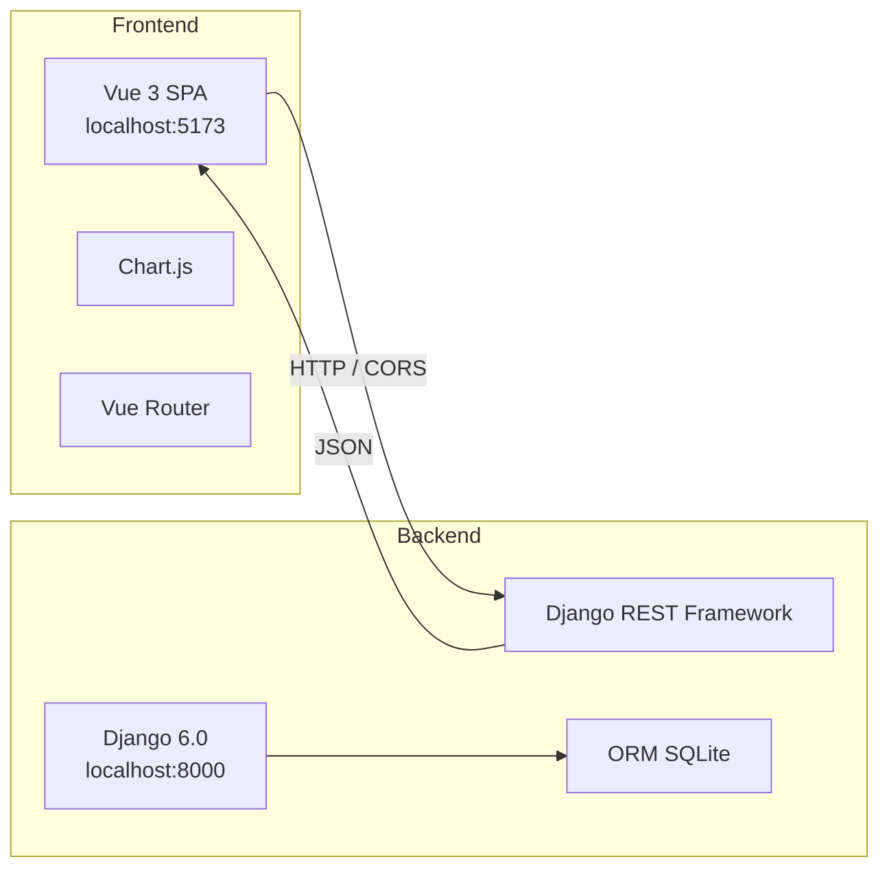

# SoftVar — Sistema de Control de Asistencia y Nómina

> **Versión:** `1.1.0`  
> **Proyecto:** Propuesta 07 – ADSO 220501094  
> **Sector:** Recursos Humanos – PyMES, Neiva, Colombia  
> **Metodología:** Scrum + Kanban

---

## 📋 Tabla de Contenido

- [Descripción](#-descripción)
- [Stack Tecnológico](#-stack-tecnológico)
- [Arquitectura](#-arquitectura)
- [Estructura del Proyecto](#-estructura-del-proyecto)
- [Modelo de Datos](#-modelo-de-datos)
- [API REST](#-api-rest)
- [Frontend — Sistema de Diseño](#-frontend--sistema-de-diseño)
- [Instalación y Configuración](#-instalación-y-configuración)
- [Uso y Desarrollo](#-uso-y-desarrollo)
- [Módulos y Roles](#-módulos-y-roles)
- [Sprint Plan](#-sprint-plan)
- [Versionado](#-versionado)
- [Licencia](#-licencia)

---

## 📖 Descripción

Sistema web integral para la gestión de **control de asistencia** y **liquidación de nómina** diseñado para PyMES colombianas. Integra reconocimiento facial biométrico, validación geográfica por GPS, cálculo de nómina conforme al CST colombiano, generación de desprendibles PDF y exportación bancaria ACH.

### Funcionalidades principales

| Módulo | Descripción |
|--------|-------------|
| **Gestión de empleados** | CRUD completo con captura biométrica facial, validación de duplicados, búsqueda |
| **Registro de asistencia** | Reconocimiento facial (face-api.js, similitud ≥ 80%) + GPS (radio 100 m) |
| **Portal personal** | Historial de asistencias, marcación entrada/salida, cambio de contraseña |
| **Liquidación de nómina** | Motor de cálculo: HE diurnas (25%), nocturnas (75%), salud (4%), pensión (4%) |
| **Desprendibles PDF** | Generación y envío masivo por correo electrónico |
| **Dashboard de reportes** | Gráficas interactivas con Chart.js |
| **Exportación ACH** | Archivo .txt delimitado por entidad bancaria |
| **Auditoría** | Registro inmutable de cambios en el sistema |

---

## 🛠 Stack Tecnológico

### Backend

| Tecnología | Versión | Uso |
|------------|---------|-----|
| Python | 3.12+ | Lenguaje de programación |
| Django | 6.0.5 | Framework web principal |
| Django REST Framework | — | API RESTful |
| django-cors-headers | — | CORS para frontend |
| django-filter | — | Filtros avanzados para API |
| SQLite | — | Base de datos (desarrollo) |

### Frontend

| Tecnología | Versión | Uso |
|------------|---------|-----|
| Vue.js | 3.5.13 | Framework frontend |
| Vue Router | 5.0.7 | Enrutamiento SPA |
| Vite | 8.0.8 | Bundler y dev server |
| Chart.js | 4.5.1 | Gráficas interactivas |
| Axios | 1.16.1 | Cliente HTTP |
| jsPDF | 4.2.1 | Generación de PDF |
| Work Sans | — | Tipografía principal UI |
| Young Serif | — | Tipografía para títulos |

---

## 🏗 Arquitectura



### Patrón: SPA + API REST

El frontend (Vue 3 SPA) se comunica con el backend (Django REST Framework) a través de una API RESTful con autenticación por sesiones. El backend utiliza SQLite como motor de base de datos en desarrollo, con migraciones gestionadas por Django ORM.

---

## 📁 Estructura del Proyecto

```
📦 SOFTVAR/
├── 📂 backend/                        # Backend Django
│   ├── 📂 empleados/                  # App de empleados
│   │   ├── 📂 management/             # Comandos personalizados
│   │   ├── 📂 migrations/             # Migraciones BD
│   │   │   ├── 0001_initial.py
│   │   │   ├── 0002_empleado_id_sede.py
│   │   │   └── 0003_remove_empleado_id_sede.py
│   │   ├── 📂 tests/                  # Tests unitarios
│   │   │   └── test_api.py
│   │   ├── admin.py                   # Panel admin Django
│   │   ├── apps.py                    # Configuración app
│   │   ├── models.py                  # Modelo Empleado
│   │   ├── serializers.py             # Serializador REST
│   │   ├── urls.py                    # Rutas API
│   │   └── views.py                   # Vistas y API endpoints
│   ├── asgi.py                        # Configuración ASGI
│   ├── settings.py                    # Configuración Django
│   ├── urls.py                        # Rutas raíz
│   └── wsgi.py                        # Configuración WSGI
│
├── 📂 frontend/                       # Frontend Vue 3
│   ├── 📂 src/
│   │   ├── 📂 assets/styles/
│   │   │   └── main.css              # Sistema de diseño (variables CSS)
│   │   ├── 📂 components/
│   │   │   └── 📂 empleados/
│   │   │       ├── EmpleadoCard.vue   # Tarjeta de empleado
│   │   │       └── FotoFacialUpload.vue # Captura biométrica
│   │   ├── 📂 views/
│   │   │   ├── 📂 asistencia/
│   │   │   │   └── RegistroAsistencia.vue
│   │   │   ├── 📂 auth/
│   │   │   │   ├── Login.vue
│   │   │   │   └── ResetPassword.vue
│   │   │   ├── 📂 configuracion/
│   │   │   │   └── Index.vue
│   │   │   ├── 📂 empleados/
│   │   │   │   ├── EmpleadoForm.vue
│   │   │   │   ├── ListEmpleados.vue
│   │   │   │   └── PortalPersonal.vue
│   │   │   ├── 📂 nomina/
│   │   │   │   └── LiquidacionNomina.vue
│   │   │   └── 📂 reportes/
│   │   │       ├── DashboardReportes.vue
│   │   │       └── ReportesFiltrables.vue
│   │   ├── App.vue                    # Layout principal (sidebar + header)
│   │   ├── main.js                    # Entry point
│   │   └── router/
│   │       └── index.js               # Configuración de rutas
│   ├── index.html
│   ├── package.json
│   └── vite.config.js
│
├── CLAUDE.md                          # Documentación del sistema de diseño
├── db.sqlite3                         # Base de datos SQLite
├── manage.py                          # CLI de Django
└── README.md                          # Este archivo
```

---

## 🗄 Modelo de Datos

### Empleado

| Campo | Tipo | Descripción |
|-------|------|-------------|
| `id` | AutoField (PK) | Identificador único |
| `cedula` | CharField(20) **UNIQUE** | Número de cédula |
| `nombres` | CharField(100) | Nombres completos |
| `apellidos` | CharField(100) | Apellidos completos |
| `email` | EmailField(150) **UNIQUE** | Correo electrónico |
| `telefono` | CharField(20) | Teléfono de contacto |
| `cargo` | CharField(100) | Cargo en la empresa |
| `tipo_contrato` | CharField(30) | Término Fijo / Indefinido / Obra Labor / Prestación Servicios |
| `salario_base` | Decimal(10,2) | Salario base mensual |
| `fecha_ingreso` | DateField | Fecha de ingreso |
| `fecha_retiro` | DateField (nullable) | Fecha de retiro |
| `eps` | CharField(100) | Entidad Promotora de Salud |
| `afp` | CharField(100) | Administradora de Fondo de Pensiones |
| `arl` | CharField(100) | Administradora de Riesgos Laborales |
| `cuenta_bancaria` | CharField(30) | Número de cuenta bancaria |
| `banco` | CharField(80) | Nombre del banco |
| `tipo_cuenta` | CharField(20) | Ahorros / Corriente |
| `foto_facial` | TextField | Descriptor biométrico (JSON base64) |
| `foto_facial_registrada` | BooleanField | Indica si tiene foto registrada |
| `activo` | BooleanField | Estado del empleado |
| `created_at` | DateTimeField | Fecha de creación |
| `updated_at` | DateTimeField | Fecha de última actualización |

---

## 🔌 API REST

### Endpoints

| Método | Endpoint | Autenticación | Descripción |
|--------|----------|---------------|-------------|
| `GET` | `/api/auth/csrf/` | No | Obtener token CSRF |
| `POST` | `/api/auth/login/` | No | Inicio de sesión |
| `POST` | `/api/auth/recuperar-contrasena/` | No | Recuperación de contraseña |
| `GET` | `/api/empleados/` | Sí | Listar empleados |
| `POST` | `/api/empleados/` | Sí | Crear empleado |
| `GET` | `/api/empleados/{id}/` | Sí | Detalle empleado |
| `PUT` | `/api/empleados/{id}/` | Sí | Actualizar empleado |
| `PATCH` | `/api/empleados/{id}/` | Sí | Actualización parcial |
| `DELETE` | `/api/empleados/{id}/` | Sí | Eliminar empleado |

### Endpoints futuros (Sprints 2-4)

| Método | Endpoint | Sprint | Descripción |
|--------|----------|--------|-------------|
| `POST` | `/api/asistencia/registrar/` | Sprint 2 | Registrar asistencia con biometría + GPS |
| `GET` | `/api/asistencia/historial/` | Sprint 2 | Historial de asistencias por empleado |
| `POST` | `/api/nomina/generar/` | Sprint 3 | Generar liquidación de nómina |
| `GET` | `/api/nomina/{id}/` | Sprint 3 | Detalle de liquidación |
| `GET` | `/api/reportes/dashboard/` | Sprint 4 | Métricas para dashboard |

### Filtros disponibles en `GET /api/empleados/`

- `search` — Búsqueda por cédula, nombres, apellidos, email, cargo
- `ordering` — Ordenar por nombres, apellidos, salario_base, fecha_ingreso
- `activo` — Filtrar por estado activo/inactivo

---

## 🎨 Frontend — Sistema de Diseño

El frontend implementa un **sistema de diseño corporativo** definido en detalle en `CLAUDE.md`. Los principios clave:

### Paleta de colores

| Color | Hex | Uso |
|-------|-----|-----|
| Azul primario | `#185FA5` | Marca, botones, headers |
| Azul oscuro | `#042C53` | Dashboard gerente |
| Verde secundario | `#3B6D11` | Nómina, finanzas, éxito |
| Neutro texto | `#2C2C2A` | Texto principal |
| Neutro fondo | `#F1EFE8` | Fondo de página |

### Tipografía

- **Work Sans** — Fuente principal para UI, cuerpo de texto, labels
- **Young Serif** — Fuente display para títulos y headers

### Componentes

El frontend cuenta con 13 vistas/componentes rediseñados con micro-interacciones, animaciones CSS, transiciones, y estados hover/focus consistentes.

### Rutas del frontend

| Ruta | Vista | Rol requerido |
|------|-------|---------------|
| `/login` | Login | Público |
| `/reset-password` | Recuperar contraseña | Público |
| `/empleados` | Listado de empleados | ADMIN_RRHH |
| `/empleados/nuevo` | Crear empleado | ADMIN_RRHH |
| `/empleados/editar/:id` | Editar empleado | ADMIN_RRHH |
| `/asistencia` | Registro de asistencia | EMPLEADO, ADMIN_RRHH |
| `/nomina` | Liquidación de nómina | CONTADOR, ADMIN_RRHH |
| `/reportes` | Dashboard | GERENTE, ADMIN_RRHH, CONTADOR |
| `/reportes/filtros` | Reportes filtrables | GERENTE, ADMIN_RRHH, CONTADOR |
| `/configuracion` | Configuración del sistema | ADMIN_SISTEMA, ADMIN_RRHH |

---

## 🚀 Instalación y Configuración

### Prerrequisitos

- **Python** 3.12 o superior
- **Node.js** 20.19+ o 22.12+
- **npm** o **pnpm**

### Backend (Django)

```bash
# 1. Clonar el repositorio
git clone <repo-url>
cd SOFTVAR

# 2. Crear y activar entorno virtual
python -m venv venv
source venv/bin/activate   # Linux/macOS
venv\Scripts\activate      # Windows

# 3. Instalar dependencias
pip install django djangorestframework django-cors-headers django-filter

# 4. Ejecutar migraciones
python manage.py migrate

# 5. Crear superusuario (opcional)
python manage.py createsuperuser

# 6. Iniciar servidor de desarrollo
python manage.py runserver
```

### Frontend (Vue 3)

```bash
# 1. Navegar al directorio frontend
cd frontend

# 2. Instalar dependencias
npm install

# 3. Iniciar servidor de desarrollo
npm run dev

# 4. Compilar para producción
npm run build
```

El frontend se ejecuta en `http://localhost:5173` y el backend en `http://localhost:8000`.

---

## 💻 Uso y Desarrollo

### Desarrollo

```bash
# Terminal 1: Backend
python manage.py runserver

# Terminal 2: Frontend
cd frontend && npm run dev
```

### Comandos útiles

```bash
# Backend
python manage.py makemigrations     # Crear migraciones
python manage.py migrate            # Aplicar migraciones
python manage.py test               # Ejecutar tests

# Frontend
cd frontend && npm run dev          # Servidor de desarrollo
cd frontend && npm run build        # Build producción
cd frontend && npm run preview      # Vista previa del build
```

---

## 👥 Módulos y Roles

| Rol | Módulos | Color |
|-----|---------|-------|
| **Administrador RRHH** | Gestión empleados, Desprendibles PDF, Credenciales, Aprobación manual | `#185FA5` |
| **Empleado** | Registro asistencia, Portal personal | `#378ADD` |
| **Contador** | Liquidación nómina, Exportación ACH/Excel | `#3B6D11` |
| **Gerente** | Dashboard reportes, Reportes filtrables | `#042C53` |
| **Admin. Sistema** | Auditoría, Parametrización SMMLV, Control acceso | `#2C2C2A` |

---

## 📅 Sprint Plan

| Sprint | Objetivo | Estado |
|--------|----------|--------|
| **Sprint 1** | Gestión de empleados (CRUD, foto facial, API REST) | ✅ Completado |
| **Sprint 2** | Control de asistencia, portal personal, autenticación | ✅ Completado |
| **Sprint 3** | Liquidación de nómina, desprendibles PDF | 📅 Planeado |
| **Sprint 4** | Dashboard, reportes, exportación ACH/Excel | 📅 Planeado |

---

## 🔖 Versionado

Este proyecto sigue el formato de versionado semántico **`MAJOR.MINOR.PATCH`**:

| Componente | Significado | Ejemplo |
|------------|-------------|---------|
| **MAJOR** | Cambios incompatibles en la API o arquitectura | `2.0.0` |
| **MINOR** | Nuevas funcionalidades compatibles hacia atrás | `1.1.0` |
| **PATCH** | Correcciones de errores y mejoras menores | `1.0.1` |

### Historial de versiones

| Versión | Fecha | Cambios |
|---------|-------|---------|
| `1.3.0` | Junio 2026 | Recuperación de contraseña: nuevo endpoint público que genera contraseña aleatoria y la envía por correo. Actualización del frontend `ResetPassword.vue` para conectar con API real. |
| `1.2.0` | Mayo 2026 | Mejoras de seguridad: detección de intentos de fraude facial, restricción de edits de perfil para empleados, prevención de registros duplicados. Corrección de bugs en validación GPS y facial. |
| `1.1.0` | Mayo 2026 | Rediseño completo del frontend. Nuevo sistema de diseño corporativo con paleta de colores azul/verde, tipografía Work Sans + Young Serif, micro-interacciones, animaciones CSS. Integración de Chart.js para dashboard. Sidebar con navegación por roles. |
| `1.0.0` | Mayo 2026 | Lanzamiento inicial. Backend Django REST con modelo Empleado, API CRUD con filtros. Frontend Vue 3 con autenticación, gestión de empleados, captura biométrica facial, registro de asistencia, liquidación de nómina simulada, dashboard con gráficas, reportes filtrables, configuración del sistema. |

---

## 📄 Licencia

© 2026 SoftVar — Proyecto académico ADSO 220501094. Todos los derechos reservados.

---

> **Documentación generada con [Codebuff](https://codebuff.com)** — Asistente de desarrollo AI.
